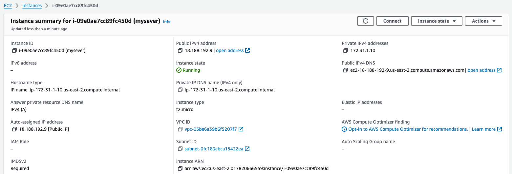

# Deploy-N-Clone-App-on-Kubernetes
This project is to deploy Netflic Clone on Kubernetes

We have five phases of implementation with this Project

* Phase 1 - Deploy netflix on EC2 or VM
* Phase 2 - Implementation of Security with sonerqube and trivy 
* Phase 3 - Let automate the whole deployment using by jenkins pipeline
* Phase 4 - Monitoring via Promotheus and grafana
* Phase 5 - Kubernetes 

