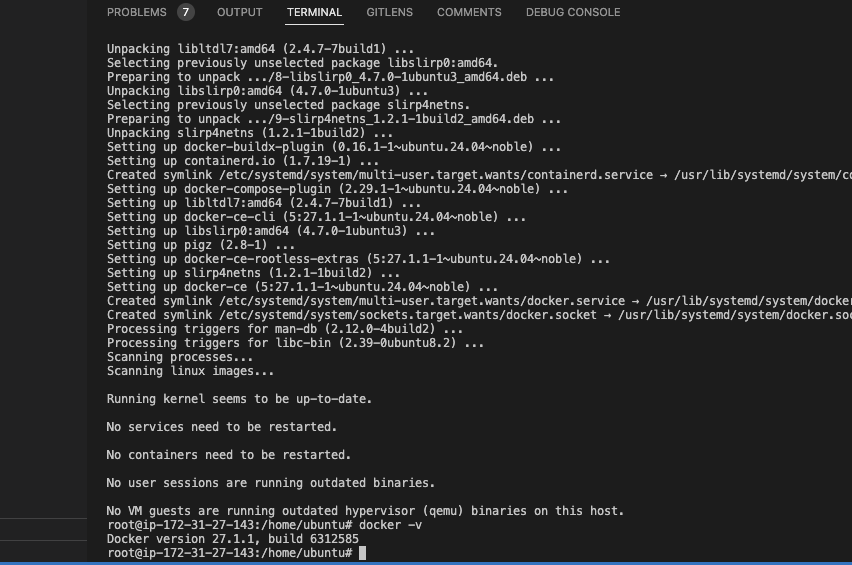

# Deploy-N-Clone-App-on-Kubernetes
This project is to deploy Netflic Clone on Kubernetes


We have five phases of implementation with this Project

**Phase 1: Deploy netflix on EC2 or VM**


**Step 1: Set Up EC2**

1. Go to the AWS console and launch an Ubuntu 22.04 instance with t2.large and 25 GB of storage. Ensure you enable the public IP in the VPC settings.

2. Connect to your EC2 instance via SSH using the following command:
    ```bash
    ssh -i "mykey.pem" ubuntu@ec2-54-197-62-157.compute-1.amazonaws.com
    ```


3. Run the following commands:
    ```bash
    sudo su
    apt update
    ```

4. Clone the GitHub repository:
    ```bash
    git clone https://github.com/Aakibgithuber/Deploy-Netflix-Clone-on-Kubernetes
    ```

5. Make sure to create an Elastic IP address and associate it with your instance.

**Step 2: Set Up Docker and Build Images**

1. Install Docker:
    ```bash
    apt-get install docker.io
    usermod -aG docker $USER # Replace with your username e.g., ‘ubuntu’
    newgrp docker
    sudo chmod 777 /var/run/docker.sock  # Grants full read, write, and execute permissions to all users for the Docker socket file.
    ```


2. Build and run the Docker container:
    ```bash
    docker build -t netflix .
    docker run -d --name netflix -p 8081:80 netflix:latest  # Maps the container port to your EC2 port.
    ```

3. Go to your EC2 instance's security groups and open port 8081 by adding a custom TCP rule.

Your application should now be running. To access it, copy the public IP of your EC2 instance and browse to `http://your_public_ip:8081`. 


If it shows a blank page, it's because you don't have an API that communicates with the Netflix database. Let's solve this in the next phase.

**What is an API?**
An API (Application Programming Interface) is like a restaurant menu that lets you order food (data or functions) from a software system or application. It allows different programs to communicate with each other and share information in a structured way.

**Step 3: Set Up Netflix API**

1. Open a web browser and navigate to the TMDB (The Movie Database) website.
2. Sign up for an account or log in if you already have one.
3. Go to your profile and select "Settings."
4. Click on "API" from the left-side panel.
5. Generate a new API key by clicking "Generate New API Key" and accepting the terms and conditions.
6. Provide the required details, such as the name and website URL of Netflix, and click "Submit."
7. You will receive your TMDB API key.


**Use the TMDB API Key**

1. Copy the API key.
2. Delete the existing Docker image:
    ```bash
    docker stop <containerid>
    docker rmi -f netflix
    ```

3. Build and run the new Docker container with the TMDB API key:
    ```bash
    docker build -t netflix:latest --build-arg TMDB_V3_API_KEY=your_api_key .
    docker run -d -p 8081:80 netflix
    ```


Your container is now created. Browse the same URL (`http://your_public_ip:8081`) again, and you will see that the whole Netflix database is connected to your Netflix clone app.


**Phase 2 - Implementation of Security with sonerqube and trivy**


* Phase 3 - Let automate the whole deployment using by jenkins pipeline
* Phase 4 - Monitoring via Promotheus and grafana
* Phase 5 - Kubernetes 


